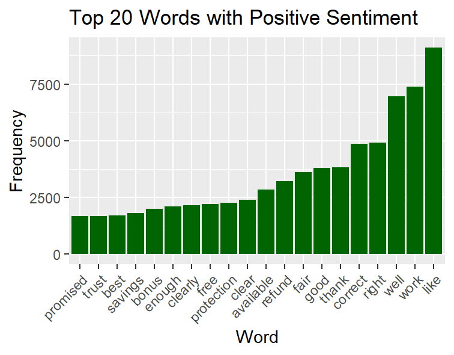

# Complaints

Introduction
This project dives into consumer complaints to find out what people are saying about different products and how they feel about them. By analyzing the text of these complaints, we aim to uncover connections between products, consumer sentiments, and the companies involved.

# Data Overview 📖

Here's what's in our dataset:

Product: The product linked to the complaint.
Complain: The actual complaint text from consumers.
Company: The company being complained about.

# Data Cleanup 🧹

We cleaned up the data by:

- Removing empty complaints to keep things tidy.
- Renaming columns to make them clearer.
- Getting rid of common words that don't add much meaning.
- Cleaning up the complaint text by removing punctuation and numbers.
- Breaking down the complaints into individual words for analysis.

# Analysis

**Finding Joy Words**

Looked for words associated with joy in the complaints to see if people are happy about certain products.

**Sentiment Check**

Counted the number of positive and negative words in each complaint to see how people feel about different products.

**Comparing Sentiment Dictionaries**

- Compared different sets of words used to measure sentiment to see which one works best.

**Visualizing Sentiment**

- I made graphs to show the overall sentiment trends across different products.

**Company Sentiment Score**

- I Calculated scores for each company based on the sentiments expressed in complaints.

**Frequency of Positive and Negative Words**

- I Checked how often positive and negative words appear in the complaints.

**Top Positive and Negative Words**

- Identified the top 20 words associated with positive and negative sentiments in the complaints.

The following visualizations were made to show the top words for negative and positive sentiment category

Negative Sentiment: 

Positive Sentiment:  < 

# Word Cloud

- The process involved generating a word cloud to illustrate the frequency of words in the complaint text. Word sizes in the cloud were determined by their frequency, with more frequent words appearing larger. This was achieved by sizing the words based on their frequency.

  

# **Conclusion**

Analyzing consumer complaints gives us valuable insights into what people think about products and services. By addressing the issues raised in complaints and paying attention to positive feedback, companies can improve customer satisfaction and loyalty. Visualizing the data, like with word clouds, helps us understand the most common words used in complaints, giving us actionable insights to work with.

